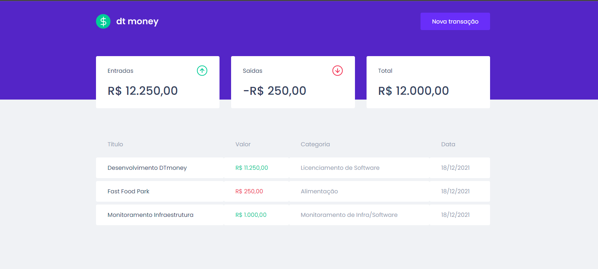
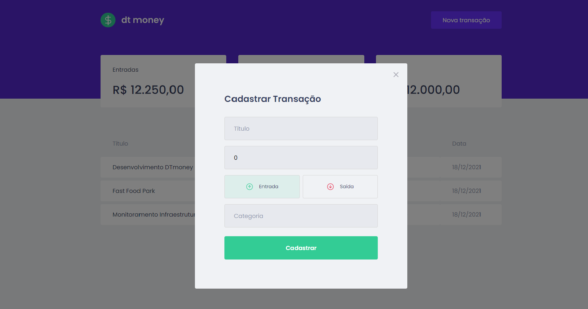

<p align="center">
   
</p>

<h3>
  <p align="center"> Aplicação para Gestão de Receitas e Despesas </p>
</h3>  

<p align="center">Projeto desenvolvido durante as aulas do Chapter II da trilha de ReactJS do Bootcamp Ignite da Rocketseat</p>

<p align="center">
   
</p>

<p align="center">
   
</p>

### Como rodar o Projeto?

 * Faça o clone do repositório em seu computador e instale as dependências com o seguinte comando no terminal/bash:
 ```bash
 yarn
 ```
  * Após finalizar a instalação dos pacotes execute o seguinte comando:
 ```bash
yarn start
 ```
 * Abra em seu navegador e digite [http://localhost:3000](http://localhost:3000) para vizualizar a aplicação.


